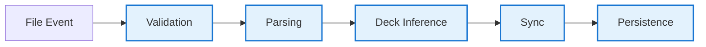
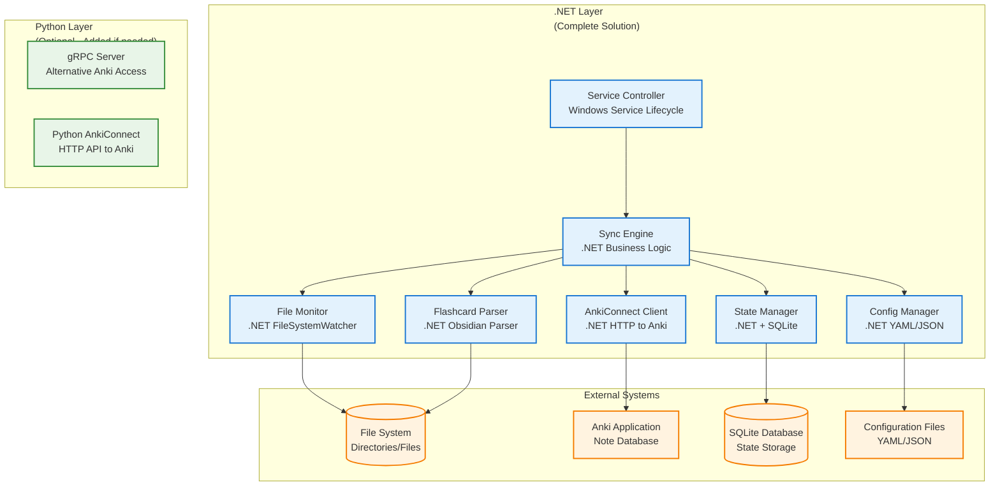
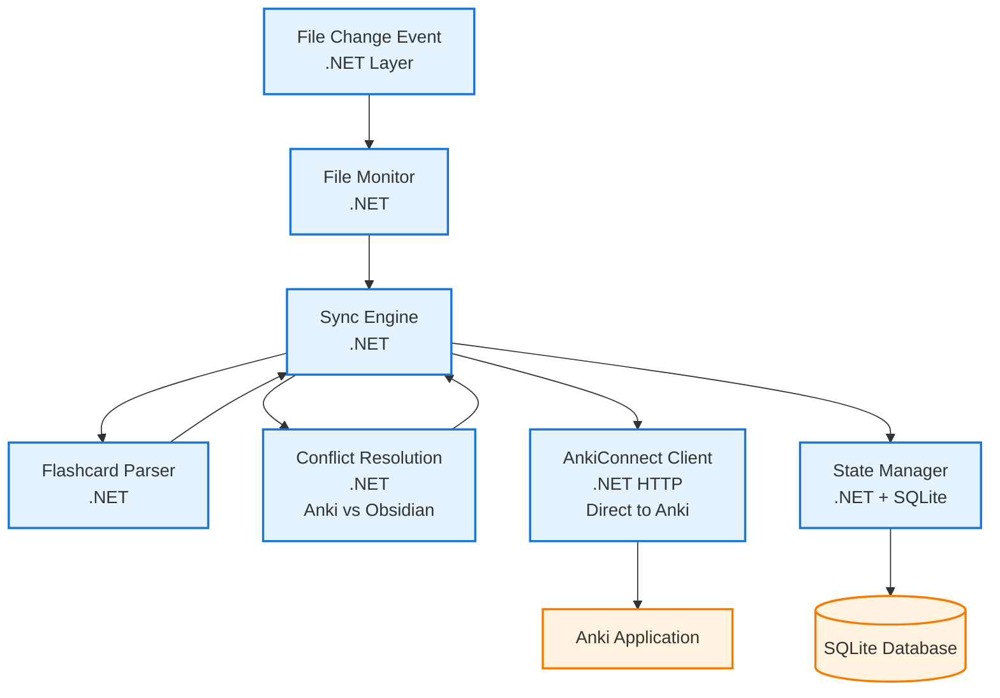

# AnkiSync Windows Service - System Architecture

## Architectural Overview

### Design Philosophy
AnkiSync follows a **modular event-driven architecture** designed for reliability and maintainability. The system uses **separation of concerns** with clear boundaries between components, enabling independent development, testing, and deployment of each module.

### Core Design Patterns

#### 1. Observer Pattern (File Monitoring)
- **FileSystemWatcher** acts as the subject, notifying observers of file system events
- **Event-driven processing** ensures responsive handling of file changes
- **Debouncing mechanism** prevents excessive processing of rapid file modifications

#### 2. Pipeline Pattern (Data Processing)



Each stage is independent, allowing for:
- **Fault isolation**: Failures in one stage don't crash the entire pipeline
- **Testing**: Each stage can be unit tested independently
- **Extensibility**: New processing stages can be added without affecting others

#### 3. Repository Pattern (Data Access)
- **StateManager** abstracts data persistence details
- **SQLite** provides ACID transactions for data consistency
- **Migration support** enables schema evolution

#### 4. Strategy Pattern (Conflict Resolution)
- **Configurable conflict resolution policies**: file_wins, anki_wins, manual
- **Runtime policy selection** based on configuration
- **Extensible**: New strategies can be added without modifying existing code

### Component Architecture

#### Layered Architecture



#### Component Coupling Analysis

**Low Coupling Components:**
- ✅ **File Monitor**: Only depends on file system APIs
- ✅ **Parser**: Pure function, no external dependencies
- ✅ **Configuration**: Simple data structures, no business logic

**Medium Coupling Components:**
- ⚠️ **Sync Engine**: Depends on StateManager, AnkiConnect, and Configuration
- ⚠️ **State Manager**: Depends on SQLite schema and business entities

**High Coupling Components:**
- ❌ **Service Controller**: Orchestrates all components (by design)

### Scalability Considerations

#### Vertical Scaling
- **Memory**: <100MB baseline, scales with number of tracked files
- **CPU**: Event-driven design minimizes idle CPU usage
- **Storage**: SQLite scales to millions of flashcards efficiently

#### Horizontal Scaling Limitations
- **Single Instance**: Windows service runs on one machine
- **Anki Dependency**: Tied to single Anki instance
- **File System Scope**: Limited to local/network file systems

#### Performance Optimizations
- **Batching**: Group operations to reduce API round trips
- **Incremental Sync**: Only process changed files
- **Lazy Loading**: Load file content only when needed
- **Connection Pooling**: Reuse AnkiConnect connections

### Reliability Architecture

#### Failure Mode Analysis

**Component Failure Scenarios:**
- **File Monitor fails**: Service continues, logs error, can restart monitor
- **Parser fails**: Skip malformed file, continue processing others
- **AnkiConnect fails**: Queue operations, retry with exponential backoff
- **Database fails**: Fallback to in-memory state, attempt recovery

**Data Consistency Guarantees:**
- **ACID Transactions**: SQLite ensures atomic operations
- **Idempotent Operations**: Safe to retry failed sync operations
- **State Reconciliation**: Periodic consistency checks between file system and Anki

#### Error Handling Strategy
- **Circuit Breaker**: Temporarily disable Anki operations during outages
- **Graceful Degradation**: Continue file monitoring even if sync fails
- **Comprehensive Logging**: Structured logging with correlation IDs
- **Health Checks**: Built-in monitoring endpoints

### Security Architecture

#### Threat Model
- **Local Operation**: No network exposure reduces attack surface
- **File System Access**: Service account needs read access to monitored directories
- **Configuration Security**: Sensitive data (API keys, paths) stored securely
- **Anki Integration**: Local HTTP communication to AnkiConnect

#### Security Controls
- **Principle of Least Privilege**: Service runs with minimal required permissions
- **Input Validation**: All file content and configuration validated
- **Secure Defaults**: Conservative configuration prevents accidental data exposure
- **Audit Logging**: Track all sync operations for accountability

### Deployment Architecture

#### Windows Service Integration
- **SCM Integration**: Proper service lifecycle management
- **Auto-start**: Configurable startup behavior
- **Recovery Actions**: Automatic restart on failure
- **Event Logging**: Integration with Windows Event Log

#### Configuration Management
- **Hierarchical Config**: Global defaults with user overrides
- **Hot Reloading**: Configuration changes without service restart
- **Validation**: Schema validation prevents misconfigurations
- **Environment-specific**: Different configs for dev/test/prod

### Maintainability Architecture

#### Code Organization
- **Modular Design**: Clear separation between components
- **Interface Contracts**: Well-defined APIs between components
- **Dependency Injection**: Testable component interactions
- **SOLID Principles**: Single responsibility, open/closed, etc.

#### Testing Strategy
- **Unit Tests**: Isolated component testing
- **Integration Tests**: Component interaction testing
- **End-to-End Tests**: Full workflow validation
- **Performance Tests**: Scalability and resource usage validation

### Evolution Roadmap

#### Phase 1: Foundation (Current)
- Basic file monitoring and parsing
- One-way sync to Anki
- SQLite state management

#### Phase 2: Enhanced Sync
- Bidirectional synchronization
- Conflict resolution policies
- Advanced deck inference

#### Phase 3: Enterprise Features
- Multi-user support
- Remote Anki instances
- Advanced analytics and monitoring

#### Phase 4: Cloud Integration
- Cloud storage support
- Distributed deployment
- Advanced collaboration features

## Hexagonal Architecture Implementation

AnkiSync implements **Hexagonal Architecture** (Ports & Adapters) to achieve:

- **Technology Independence**: Business logic decoupled from external technologies
- **Testability**: Easy mocking of external dependencies
- **Maintainability**: Clear separation between business and infrastructure concerns
- **Evolvability**: Ability to swap implementations without changing core logic

### Architecture Overview

```mermaid
graph TB
    %% External Systems (Outside the Hexagon)
    subgraph "External Systems"
        WS[Windows Service<br/>File System Events]
        CLI[CLI Commands]
        FS[(File System<br/>Directories/Files)]
        ANKI[Anki Application<br/>Note Database]
        DB[(SQLite Database<br/>State Storage)]
        CFG[Configuration Files<br/>YAML/JSON]
    end

    %% Adapters Ring (Outer Layer)
    subgraph "Adapters Ring<br/>(Infrastructure Layer)"
        subgraph "Driving Adapters<br/>(Input Ports)"
            WSA[Windows Service Adapter<br/>Service Lifecycle<br/>Orchestration]
        end

        subgraph "Driven Adapters<br/>(Output Ports)"
            FSA[FileSystemAdapter<br/>.NET<br/>FileSystemWatcher<br/>File I/O]
            ACA[AnkiConnectAdapter<br/>.NET<br/>HTTP Client to Anki<br/>(Python optional)]
            SA[SQLiteAdapter<br/>.NET<br/>State Persistence<br/>Query Optimization]
            YCA[YAMLConfigAdapter<br/>.NET<br/>Configuration Loading<br/>Validation]
        end
    end

    %% Ports (Interfaces/Contracts)
    subgraph "Ports<br/>(Boundaries)"
        FSP[FileSystemPort<br/>IFileSystemPort]
        AP[AnkiPort<br/>IAnkiPort]
        SP[StatePort<br/>IStatePort]
        CP[ConfigPort<br/>IConfigurationPort]
    end

    %% Application Layer (Use Cases)
    subgraph "Application Layer<br/>(Use Cases)"
        SS[SyncService<br/>ISyncService<br/>Main sync orchestration]
        PS[ParseService<br/>IFlashcardParser<br/>Flashcard parsing]
        DIS[DeckInferenceService<br/>IDeckInferenceService<br/>Deck determination]
    end

    %% Domain Layer (Core Business Logic)
    subgraph "Domain Layer<br/>(Business Rules)"
        subgraph "Domain Services"
            CRS[ConflictResolver<br/>Domain Service<br/>Conflict resolution logic]
        end

        subgraph "Entities<br/>(Domain Objects)"
            FC[Flashcard<br/>Question/Answer/Tags]
            SS2[SyncState<br/>File sync status]
            FC2[FileChange<br/>Change events]
        end
    end

    %% Communication Infrastructure
    subgraph "Communication Infrastructure"
        GRPC[gRPC Interface<br/>.NET ↔ Python<br/>Protobuf Contracts<br/>Inter-process Communication]
    end

    %% External Systems
    subgraph "External Systems"
        FS[(File System<br/>Directories/Files)]
        ANKI[Anki Application<br/>Note Database]
        DB[(SQLite Database<br/>State Storage)]
        CFG[Configuration Files<br/>YAML/JSON]
    end

    %% Connections - Hexagonal Architecture Flow
    %% External Systems → Adapters
    WS --> WSA
    CLI --> WSA
    FSA --> FS
    ACA --> ANKI
    SA --> DB
    YCA --> CFG

    %% Adapters implement Ports (interfaces)
    FSA -.-> FSP
    ACA -.-> AP
    SA -.-> SP
    YCA -.-> CP

    %% Application Layer depends on Ports (not adapters)
    SS -.-> FSP
    SS -.-> AP
    SS -.-> SP
    PS -.-> FSP
    DIS -.-> FSP
    SS -.-> CP

    %% Application Layer orchestrates Domain Layer
    SS --> CRS
    PS --> FC
    DIS --> FC
    SS --> SS2
    SS --> FC2
    CRS --> FC
    CRS --> SS2

    %% Driving Adapter triggers Application Layer
    WSA --> SS

    %% Communication Infrastructure
    SS -.-> GRPC
    GRPC -.-> ACA
    YCA --> CFG

    %% Styling - Hexagonal Architecture Layers
    classDef external fill:#ffebee,stroke:#b71c1c,stroke-width:2px
    classDef adapters fill:#e8f5e8,stroke:#2e7d32,stroke-width:2px
    classDef ports fill:#fff3e0,stroke:#ef6c00,stroke-width:2px
    classDef application fill:#e3f2fd,stroke:#1565c0,stroke-width:2px
    classDef domain fill:#f3e5f5,stroke:#6a1b9a,stroke-width:2px
    classDef communication fill:#fce4ec,stroke:#ad1457,stroke-width:2px

    class WS,CLI,FS,ANKI,DB,CFG external
    class WSA,FSA,ACA,SA,YCA adapters
    class FSP,AP,SP,CP ports
    class SS,PS,DIS application
    class CRS,FC,SS2,FC2 domain
    class GRPC communication
```

### Hexagonal Architecture Layers Explained

The diagram above follows the **Hexagonal Architecture** (Ports & Adapters) pattern with clear separation of concerns:

#### 1. **External Systems** (Outside the Hexagon)
- **Windows Service & CLI**: Entry points that trigger the application
- **File System, Anki, Database, Config**: External dependencies the application interacts with
- **Purpose**: Represent the real world that the application serves

#### 2. **Adapters Ring** (Infrastructure Layer)
- **Driving Adapters**: Handle input from external systems (Windows Service Adapter)
- **Driven Adapters**: Handle output to external systems (FileSystem, AnkiConnect, SQLite, YAML adapters)
- **Purpose**: Translate between external system protocols and internal application protocols

#### 3. **Ports** (Contract Interfaces)
- **FileSystemPort, AnkiPort, StatePort, ConfigPort**: Define the contracts that adapters must implement
- **Purpose**: Specify what the application needs from external systems without specifying how

#### 4. **Application Layer** (Use Cases)
- **SyncService, ParseService, DeckInferenceService**: Orchestrate domain logic to fulfill business use cases
- **Purpose**: Contain application-specific logic and orchestrate domain objects

#### 5. **Domain Layer** (Core Business Rules)
- **Entities**: Flashcard, SyncState, FileChange - pure business objects with no external dependencies
- **Domain Services**: ConflictResolver - business logic that doesn't naturally belong to entities
- **Purpose**: Contain the core business rules and logic that are independent of any external concerns

#### 6. **Communication Infrastructure**
- **gRPC Interface**: Enables inter-process communication between .NET and Python components (added only if direct .NET AnkiConnect proves unreliable)
- **Purpose**: Facilitates communication between different technology stacks while maintaining separation

### Key Hexagonal Architecture Principles

1. **Dependency Inversion**: Inner layers define interfaces (ports) that outer layers implement
2. **Technology Independence**: Core business logic knows nothing about external technologies
3. **Testability**: Each layer can be tested in isolation by mocking outer dependencies
4. **Multiple Interfaces**: The application can be driven by different input adapters and drive different output adapters

### Core Domain (Business Logic)

The **domain layer** contains pure business logic with no external dependencies:

#### Entities
Core business entities represent the fundamental concepts:
- **Flashcard**: Represents a question/answer pair with metadata (tags, source location, card type)
- **SyncState**: Tracks synchronization status for files (last modified, Anki note IDs, sync timestamps)
- **FileChange**: Represents file system events (creation, modification, deletion)

#### Use Cases (Application Services)
Application services orchestrate domain logic to fulfill business requirements:
- **SyncService**: Main synchronization orchestration logic
- **ParseService**: Flashcard parsing and extraction from files
- **DeckInferenceService**: Business logic for determining appropriate Anki decks from file metadata

### Ports (Interfaces)

Ports define the contract between core domain and external world:

#### Driving Ports (Input)
- **FileSystemPort**: Contract for file system interactions (watching directories, reading files, getting metadata)

#### Driven Ports (Output)
- **AnkiPort**: Contract for Anki communication (creating/updating notes, managing decks)
- **StatePort**: Contract for state persistence (saving/retrieving sync state, querying modified files)
- **ConfigurationPort**: Contract for configuration access (watched directories, file extensions, sync settings)

### Adapters (Implementations)

Adapters implement the ports and handle external concerns:

#### Driving Adapters (Primary/Input)
- **WindowsServiceAdapter**: Windows Service that drives the application (service lifecycle, sync loop orchestration)

#### Driven Adapters (Secondary/Output)
- **FileSystemAdapter**: File system operations using .NET FileSystemWatcher
- **AnkiConnectAdapter**: HTTP client for AnkiConnect API communication
- **SQLiteAdapter**: Database operations for state persistence
- **YAMLConfigAdapter**: Configuration loading and validation
            "action": "addNote",
            "version": 6,
            "params": {
                "note": {
                    "deckName": note.deck_name,
                    "modelName": note.model_name,
                    "fields": note.fields,
                    "tags": note.tags
                }
            }
        }

        async with self.session.post(self.base_url, json=payload) as response:
            result = await response.json()
            if result.get("error"):
                raise AnkiError(result["error"])
            return result["result"]

class SQLiteAdapter:
    """SQLite persistence adapter"""

    def __init__(self, db_path: Path):
        self.db_path = db_path
        self._init_db()

    def _init_db(self) -> None:
        """Initialize database schema"""
        with sqlite3.connect(self.db_path) as conn:
            conn.execute("""
                CREATE TABLE IF NOT EXISTS sync_states (
                    file_path TEXT PRIMARY KEY,
                    last_modified TEXT,
                    anki_note_ids TEXT,  -- JSON array
                    last_sync TEXT
                )
            """)

    async def save_sync_state(self, state: SyncState) -> None:
        """Implement StatePort.save_sync_state"""
        async with aiosqlite.connect(self.db_path) as conn:
            await conn.execute("""
                INSERT OR REPLACE INTO sync_states
                (file_path, last_modified, anki_note_ids, last_sync)
                VALUES (?, ?, ?, ?)
            """, (
                str(state.file_path),
                state.last_modified.isoformat(),
                json.dumps(state.anki_note_ids),
                state.last_sync.isoformat()
            ))
            await conn.commit()

class YAMLConfigAdapter:
    """YAML configuration adapter"""

    def __init__(self, config_path: Path):
        self.config_path = config_path
        self._config = self._load_config()

    def _load_config(self) -> Dict:
        """Load and validate configuration"""
        with open(self.config_path, 'r') as f:
            config = yaml.safe_load(f)
        # Validate configuration schema
        return config

    def get_watched_directories(self) -> List[Path]:
        """Implement ConfigurationPort.get_watched_directories"""
        dirs = self._config.get('directories', [])
        return [Path(d['path']) for d in dirs]
```

### gRPC Interface Design

The gRPC interface provides a lightweight, high-performance communication layer between the .NET and Python components:

#### Service Definition (Protobuf)
```protobuf
syntax = "proto3";

package anki_sync;

service AnkiSyncService {
  // Query Operations
  rpc GetDecks(GetDecksRequest) returns (GetDecksResponse);
  rpc GetNotes(GetNotesRequest) returns (GetNotesResponse);
  rpc GetModels(GetModelsRequest) returns (GetModelsResponse);
  
  // Update Operations
  rpc CreateNote(CreateNoteRequest) returns (CreateNoteResponse);
  rpc UpdateNote(UpdateNoteRequest) returns (UpdateNoteResponse);
  rpc DeleteNote(DeleteNoteRequest) returns (DeleteNoteResponse);
  
  // Sync Operations
  rpc BatchSync(BatchSyncRequest) returns (BatchSyncResponse);
  rpc CreateDeck(CreateDeckRequest) returns (CreateDeckResponse);
  
  // Health Check
  rpc HealthCheck(HealthCheckRequest) returns (HealthCheckResponse);
}

message Flashcard {
  string id = 1;
  string question = 2;
  string answer = 3;
  string card_type = 4;
  repeated string tags = 5;
  string deck_name = 6;
  string model_name = 7;
  map<string, string> fields = 8;
}

message GetDecksRequest {}
message GetDecksResponse {
  repeated string deck_names = 1;
}

message CreateNoteRequest {
  Flashcard flashcard = 1;
}
message CreateNoteResponse {
  string note_id = 1;
}

message BatchSyncRequest {
  repeated Flashcard flashcards = 1;
  string conflict_resolution = 2;
}
message BatchSyncResponse {
  repeated SyncResult results = 1;
}

message SyncResult {
  string flashcard_id = 1;
  string status = 2;  // "created", "updated", "skipped", "error"
  string note_id = 3;
  string error_message = 4;
}
```

#### Python gRPC Server Implementation (Optional)
The Python gRPC server provides a lightweight service layer that:
- Receives flashcard data via gRPC from the .NET layer
- Converts protobuf messages to AnkiConnect HTTP API format
- Handles batch operations for efficient Anki communication
- Manages error handling and retry logic for Anki API calls
- Returns operation results back to the .NET layer

**Note**: Python layer is only implemented if direct .NET AnkiConnect communication proves unreliable.

#### .NET gRPC Client Implementation
```csharp
public class AnkiSyncGrpcClient
{
    private readonly AnkiSyncService.AnkiSyncServiceClient _client;
    
    public AnkiSyncGrpcClient(GrpcChannel channel)
    {
        _client = new AnkiSyncService.AnkiSyncServiceClient(channel);
    }
    
    public async Task<string> CreateNoteAsync(Flashcard flashcard)
    {
        var request = new CreateNoteRequest
        {
            Flashcard = ConvertToProtobuf(flashcard)
        };
        
        var response = await _client.CreateNoteAsync(request);
        return response.NoteId;
    }
    
    public async Task<BatchSyncResponse> BatchSyncAsync(
        IEnumerable<Flashcard> flashcards, 
        string conflictResolution)
    {
        var request = new BatchSyncRequest
        {
            ConflictResolution = conflictResolution
        };
        
        request.Flashcards.AddRange(
            flashcards.Select(ConvertToProtobuf));
        
        return await _client.BatchSyncAsync(request);
    }
}
```

### Lightweight AnkiConnect Layer

The Python layer serves as a thin wrapper around AnkiConnect:

#### Responsibilities
- **HTTP Communication**: Handle AnkiConnect HTTP API calls
- **Error Handling**: Retry logic and error translation
- **Data Transformation**: Convert between gRPC/protobuf and AnkiConnect formats
- **Connection Management**: Pool connections and handle timeouts
- **Health Monitoring**: Provide health check endpoints

#### Non-Responsibilities
- **Business Logic**: No sync logic, conflict resolution, or state management
- **File Processing**: No file system operations or flashcard parsing
- **Configuration**: No configuration management
- **Windows Integration**: No Windows-specific functionality

#### Key Design Principles
1. **Minimal Interface**: Expose only essential Anki operations
2. **Stateless**: No session state or complex workflows
3. **Idempotent**: Safe to retry operations
4. **Observable**: Comprehensive logging and metrics
5. **Testable**: Easy to mock AnkiConnect for testing

### Communication Patterns

#### Synchronous Operations
- **Create/Update/Delete**: Immediate response with result
- **Queries**: Direct response with requested data
- **Health Checks**: Quick status responses

#### Batch Operations
- **Batch Sync**: Process multiple flashcards in single call
- **Streaming**: For large datasets, use streaming responses
- **Progress Reporting**: Optional progress callbacks

#### Error Handling
- **gRPC Status Codes**: Use appropriate gRPC status codes
- **Detailed Messages**: Include actionable error information
- **Retry Logic**: Client handles retries, server focuses on single operations

### Deployment Architecture

#### Process Architecture
```
┌─────────────────┐    ┌─────────────────┐
│   .NET Service  │    │ Python gRPC     │
│   (Windows)     │◄──►│ Service         │
│                 │    │ (AnkiConnect)  │
└─────────────────┘    └─────────────────┘
         │                        │
         └────────────────────────┘
                localhost
                    │
          ┌─────────────────┐
          │   Anki App      │
          │   (HTTP API)    │
          └─────────────────┘
```

#### Inter-Process Communication
- **Protocol**: gRPC over local Unix socket (Linux) or named pipe (Windows)
- **Security**: Local-only communication, no network exposure
- **Performance**: Low-latency, high-throughput communication
- **Reliability**: Automatic reconnection and health monitoring

This architecture provides clean separation between Windows integration (.NET) and Anki communication (Python), with gRPC serving as the lightweight communication layer.

### Dependency Injection & Composition

The application is composed using dependency injection across both .NET and Python components:

#### .NET Service Composition
```csharp
public class Startup
{
    public void ConfigureServices(IServiceCollection services)
    {
        // Infrastructure (Adapters)
        services.AddSingleton<IConfigurationPort, YamlConfigurationAdapter>();
        services.AddSingleton<IFileSystemPort, WindowsFileSystemAdapter>();
        services.AddSingleton<IStatePort, SqliteStateAdapter>();
        
        // gRPC Client for Anki communication
        services.AddGrpcClient<AnkiSyncService.AnkiSyncServiceClient>(options =>
        {
            options.Address = new Uri("http://localhost:50051");
        });
        services.AddSingleton<IAnkiPort, GrpcAnkiAdapter>();
        
        // Domain Services
        services.AddSingleton<IDeckInferenceService, DeckInferenceService>();
        services.AddSingleton<IFlashcardParser, ObsidianFlashcardParser>();
        
        // Application Services (Use Cases)
        services.AddSingleton<ISyncService, SyncService>();
        
        // Windows Service
        services.AddHostedService<WindowsServiceAdapter>();
    }
}
```

#### Python gRPC Service Composition
The Python gRPC service is composed with minimal dependencies focused on Anki communication:
- **AnkiConnect Client**: HTTP client for Anki API communication
- **Note Manager**: Lightweight service for Anki note operations
- **gRPC Service**: Servicer implementation exposing Anki capabilities through gRPC interface
    
    server = grpc.aio.server()
    anki_sync_pb2_grpc.add_AnkiSyncServiceServicer_to_server(
        service, server)
    
    server.add_insecure_port("[::]:50051")
    await server.start()
    await server.wait_for_termination()
```

#### Cross-Platform Composition Benefits (Optional Python Layer)
- **Technology Independence**: .NET handles Windows concerns, Python handles Anki communication (if needed)
- **Independent Deployment**: Services can be updated independently (if Python layer is added)
- **Clear Boundaries**: gRPC interface defines the contract between layers (if implemented)
- **Testability**: Each layer can be tested in isolation
- **Scalability**: Python layer can be scaled separately if needed (if implemented)

### Testing with Hexagonal Architecture

Hexagonal architecture enables comprehensive testing:

#### Unit Tests (Core Domain)
- **Entity Tests**: Validate business object behavior and invariants
- **Use Case Tests**: Test application service orchestration with mocked ports
- **Domain Service Tests**: Test pure business logic functions

#### Integration Tests (Ports)
- **Port Interface Tests**: Test application services with mocked port implementations
- **Contract Verification**: Ensure ports define complete interfaces for their responsibilities

#### Adapter Tests (External Integration)
- **Infrastructure Integration**: Test adapters against real external systems (using test instances)
- **Contract Compliance**: Verify adapter implementations meet their port interface requirements

### Benefits Achieved

#### Testability
- **100% core logic testability** without external dependencies
- **Mockable adapters** for integration testing
- **Isolated testing** of each architectural layer

#### Maintainability
- **Clear separation** between business and infrastructure logic
- **Single Responsibility** - each adapter has one external concern
- **Dependency Inversion** - core depends on abstractions, not concretions

#### Evolvability
- **Technology Swapping**: Replace SQLite with PostgreSQL by implementing new StatePort adapter
- **New Input Channels**: Add REST API by creating new driving adapter
- **Feature Extensions**: Add new use cases without touching existing code

#### Deployment Flexibility
- **Same Core, Different Deployments**: Console app, Windows service, or web API
- **Configuration-Driven**: Different environments use different adapter configurations
- **Gradual Migration**: Swap adapters incrementally

This hexagonal architecture provides a solid foundation for long-term maintainability and evolution of the AnkiSync system.

## Data Flow



## Key Requirements

### Functional Requirements

#### File Monitoring
- [ ] Monitor multiple directories recursively
- [ ] Support file extensions: .md, .txt, .py, .js, etc.
- [ ] Handle file locking during writes
- [ ] Debounce rapid changes (500ms window)
- [ ] Detect file moves, renames, deletions

#### Flashcard Processing
- [ ] Parse all Obsidian Spaced Repetition formats
- [ ] Extract deck information from file paths
- [ ] **Extract tags and infer decks from Obsidian tags**
- [ ] Handle encoding (UTF-8, UTF-16, etc.)
- [ ] Validate flashcard syntax

#### Anki Synchronization
- [ ] Create/update/delete Anki notes
- [ ] Map flashcards to appropriate decks
- [ ] Handle bidirectional sync conflicts
- [ ] Preserve Anki review history
- [ ] Batch operations (100 cards per batch)

#### State Management
- [ ] Track file modification timestamps
- [ ] Map flashcards to Anki note IDs
- [ ] Detect changes since last sync
- [ ] Handle file renames/moves
- [ ] Incremental sync optimization

### Non-Functional Requirements

#### Performance
- [ ] Sync latency: <5 seconds for file changes
- [ ] Memory usage: <100MB during normal operation
- [ ] CPU usage: <5% during sync operations
- [ ] Handle 1000+ flashcards efficiently

#### Reliability
- [ ] 99.9% uptime for file monitoring
- [ ] Automatic retry on Anki connection failures
- [ ] Graceful handling of malformed files
- [ ] Data consistency guarantees

#### Usability
- [ ] Clear logging and error messages
- [ ] Configuration validation
- [ ] Service status monitoring
- [ ] Easy installation/uninstallation

#### Security
- [ ] Local operation only (no external data transmission)
- [ ] Secure configuration file handling
- [ ] No elevation requirements beyond service account

## Configuration Schema

```yaml
# config.yaml
directories:
  - path: "C:\\Users\\User\\Obsidian\\Notes"
    recursive: true
    extensions: [".md", ".txt"]
  - path: "C:\\Users\\User\\Documents\\Flashcards"
    recursive: false
    extensions: [".md"]

anki:
  base_url: "http://localhost:8765"
  default_deck: "Default"
  # Deck hierarchy is automatically inferred from tag nesting
  # Examples:
  #   #algorithms/datastructures → "Algorithms::Datastructures"
  #   #programming/python → "Programming::Python"
  #   #science/biology/cells → "Science::Biology::Cells"
  create_decks: true  # Auto-create deck hierarchies when inferred

sync:
  batch_size: 50
  debounce_ms: 500
  conflict_resolution: "file_wins"  # file_wins | anki_wins | manual
  bidirectional_sync: false

logging:
  level: "INFO"
  file: "C:\\ProgramData\\AnkiSync\\logs\\service.log"
  max_size_mb: 10
  retention_days: 30
```

## Error Handling Strategy

### File Processing Errors
- Malformed flashcard syntax → Log warning, skip card
- File encoding issues → Log error, skip file
- Permission denied → Log error, retry later

### Anki Connection Errors
- Connection refused → Retry with exponential backoff
- Anki not running → Queue changes, retry periodically
- API errors → Log details, retry or skip

### Sync Conflicts
- File modified after Anki → Follow conflict_resolution policy
- Anki note deleted → Recreate from file
- Deck not found → Create deck or use default

## Deployment Architecture

### Development Environment
- Local Anki instance for testing
- Mock file system for unit tests
- SQLite in-memory for state testing

### Production Environment
- Windows Service installation
- ProgramData directory for config/logs
- SQLite database for state persistence
- Event logging integration

## Success Metrics

### User Experience
- File changes sync within 5 seconds
- No data loss during sync operations
- Clear error reporting for issues
- Minimal system resource usage

### Technical Performance
- 99.9% file monitoring reliability
- <1% sync failure rate
- <100MB memory usage
- <5% CPU usage during sync

### Maintainability
- Comprehensive logging
- Configuration-driven behavior
- Modular architecture
- Automated testing coverage